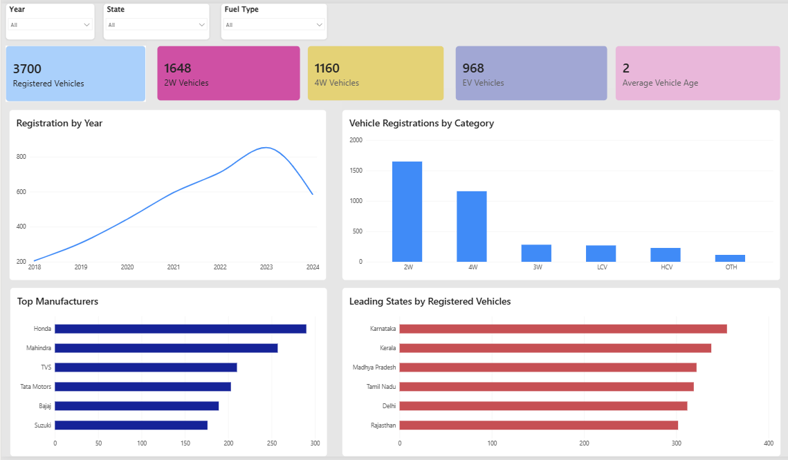
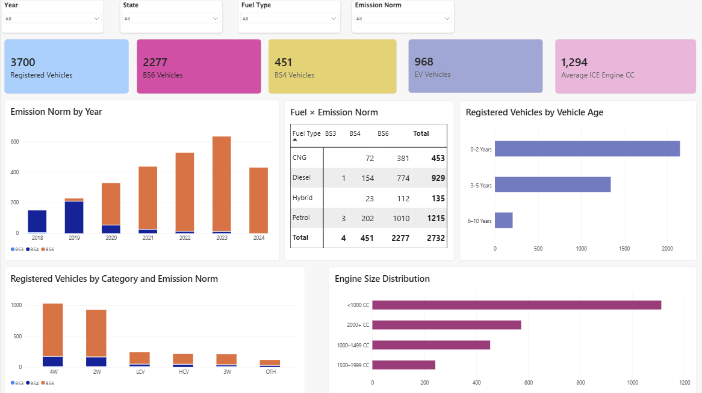

# 🚗 Vahan Vehicle Registration Data Analysis

## 📌 Project Description

An end-to-end data analytics project using **Python, SQL, PostgreSQL, and Power BI** to analyze vehicle registration data and understand fleet composition, registration trends, fuel types, EVs, vehicle categories, vehicle age, engine size, geographic distribution, and applicable emission norms.

The project transforms vehicle-registration data into actionable insights through data cleaning, SQL analysis, and an interactive Power BI dashboard.

---

## 🎯 Objectives

- Clean and preprocess vehicle registration data.
- Analyze vehicle registration trends over time.
- Understand vehicle category and fuel-type distribution.
- Analyze EV presence within the registered fleet.
- Study applicable BS3, BS4 and BS6 emission norms.
- Identify leading states and manufacturers.
- Analyze vehicle age and ICE engine-size distribution.
- Perform structured analysis using SQL.
- Build a dynamic and interactive Power BI dashboard.
- Establish a baseline for future vehicle-emission analysis.

---

## 🛠️ Tools & Technologies

| Tool | Purpose |
|---|---|
| Python | Data cleaning and preprocessing |
| Pandas | Data manipulation and analysis |
| NumPy | Numerical operations |
| Matplotlib | Data visualization |
| Seaborn | Exploratory visualization |
| PostgreSQL | Database management |
| SQL | Analytical queries |
| Power BI | Interactive dashboard |
| DAX | Dynamic KPIs and calculations |
| GitHub | Project documentation and version control |

---

# 📊 Power BI Dashboard

The project includes two interactive Power BI dashboard pages designed to provide a clear view of vehicle fleet composition and emission-related characteristics.

## 📄 Page 1 — Fleet Overview



This page provides an overview of:
- Total registered vehicles
- 2W and 4W vehicles
- EV vehicles
- Average vehicle age
- Registration trends
- Vehicle categories
- Top manufacturers
- Leading states

---

## 📄 Page 2 — Emission Profile



This page focuses on:
- BS6 and BS4 vehicle counts
- EV vehicles
- Average ICE engine CC
- Emission norms by year
- Fuel × Emission Norm
- Vehicle age groups
- Vehicle category × emission norm
- Engine size distribution

## 🔄 Project Workflow

```text
Raw Vehicle Data
       ↓
Python / Pandas
       ↓
Data Cleaning & Validation
       ↓
PostgreSQL
       ↓
SQL Analysis
       ↓
Power BI Data Modeling
       ↓
DAX Measures
       ↓
Interactive Dashboard
       ↓
Insights & Interpretation`


